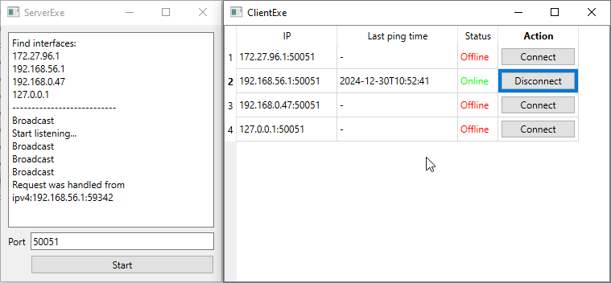

# gRPC-Qt
A simple example of client-server applications which send Ping/Pong via gRpc.

## How to Build?

Requirements:
- cmake >= 3.16
- conan >= 2
- Qt >= 6.0

Some dependencies, such as `protobuf` and `grpc`, are installed via `conan`. That's why you need to specify `-DCMAKE_PROJECT_TOP_LEVEL_INCLUDES="conan_provider.cmake"` option, as well as `-DCMAKE_BUILD_TYPE`. **But Qt is not installed via conan, since it's extremely huge.**

```bash
cmake -B build -S . -DCMAKE_PROJECT_TOP_LEVEL_INCLUDES="conan_provider.cmake" -DCMAKE_BUILD_TYPE=Release
```

The command may look different in case you need to specify Qt path:

```bash
cmake -B build -S . -DCMAKE_PROJECT_TOP_LEVEL_INCLUDES="conan_provider.cmake" -DCMAKE_BUILD_TYPE=Release -DCMAKE_PREFIX_PATH="C:\Qt\6.8.0\msvc2022_64\
```

```bash
cmake --build build --config Release
```

## How does it look like?

